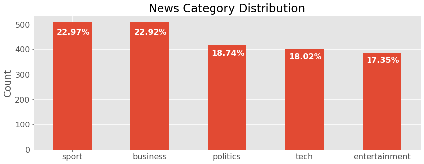
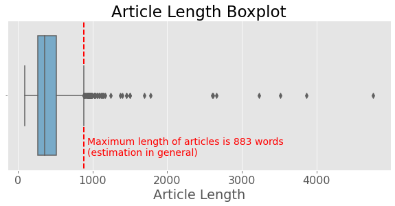
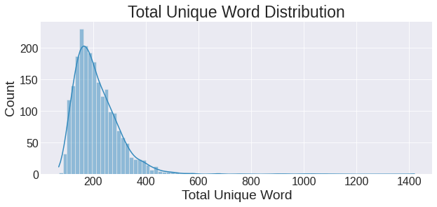
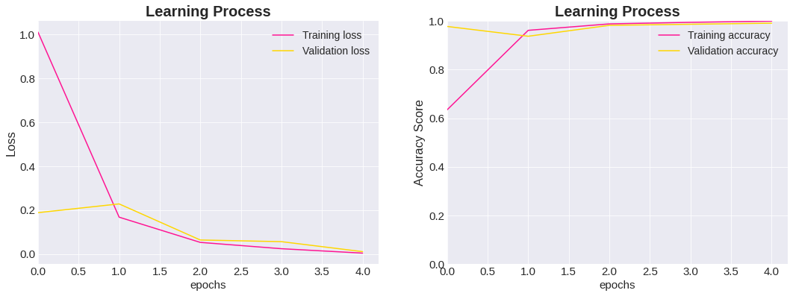

# Description
This project builds a model for classifying news articles based on their content. The dataset is explored first, to build the model optimally. Then the model is deployed into a web app.

Tags: `NLP`, `EDA`, `Deployment`, `TensorFlow`

# Exploratory Data Analysis

1. The news category is **spread fairly evenly** in the range of **17.35% to 22.97%**. The most category is the **sport** and the lowest is entertainment.

2. It seems that the word _'Film'_ can be the key in the category of entertainment. But on the other hand, it is **quite difficult to determine the keywords** for other categories. This can be seen from words such as ***'Said'*** and ***'Will'*** which also **appear a lot in each category.**

3. A news article can be up to **4759** words long. But this might be very rare. It is **estimated generally** that the **maximum length** of news articles is **883 words**.

4. From the data used, the number of different words in a news article **varies from 69 to 1421 words**. The average number is **214** unique words. This is more than the **median value of 195**.

5. The ratio of unique words to Article Length appears to be normally distributed, with the median and mean of about 50%.

6. There is **no strong impact** between news categories with the length of the article or with the number of different words in it. This is **evidenced by the correlation value**, only in the range of **-0.129 to 0.248**.

# Model Building
Modeling using statistics from the EDA stage shows the model can be built properly and effectively. This is indicated by the accuracy that can reach **99%** in less than 2 minutes. Besides, from the plot learning process, it can be seen that the model can learn well.

# Deployment
Deployment is done into a web app, with several features such as:
1. Can make predictions from news articles from languages other than English, such as Indonesian.
2. designed to be more interactive by displaying prediction results in the form of images and graphs.
3. There is a feature to view the initial processing of the text.