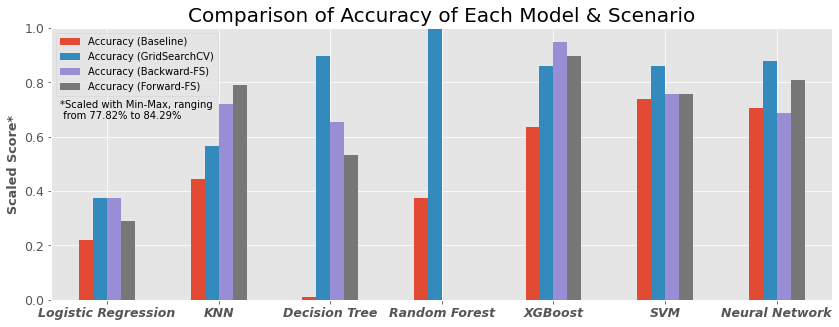
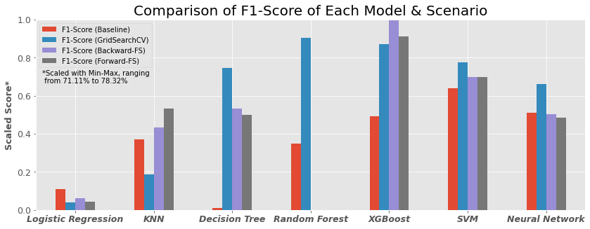

# Description 

Machine learning can be used for binary classification problems. several methods can be used. Ranging from simple to complex. The use of default parameters does not always match the data used, so hyperparameter tuning is necessary. One technique of them with grid-search CV. In addition, to optimize the results, we could use the feature selection technique, to select only certain parameters that have a significant effect on the classification results.
The process is quite long and some parts are repeated. For this reason, in this project, I apply an Automation pipeline to make it more efficient. As a simulation, the Titanic dataset is used. 

_Keywords_: `Automation`, `Grid-Search CV`, `Feature Selection`, `Classification`, `Titanic Dataset`,

# Dataset Source

* https://raw.githubusercontent.com/ageron/handson-ml2/master/datasets/titanic/train.csv
* https://www.kaggle.com/c/titanic/data

# Result

* Grid-Search CV technique shows improvement to the accuracy of all models. In certain models, such as the _Decision Tree_ has increased to more than 5%. The best accuracy results are achieved using the Random Forest model.
* Implementation of feature selection only provides improvements to some models only. However, this technique gives the highest F1-Score results with the XGBoost model.
* If would like to maximize accuracy, the random forest model with Grid-Search CV could be the best choice. However, if want a model that could provide a good classification for each class, the XGBoost model with Grid-Search CV combined with backward sequential feature selection can be an option. Since, it has the highest F1-Score and its accuracy is second.